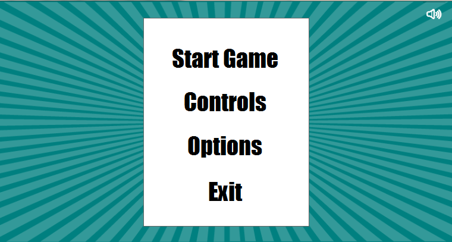
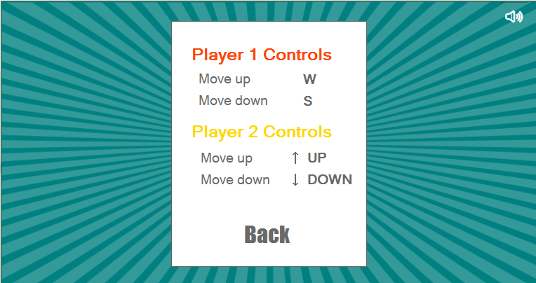
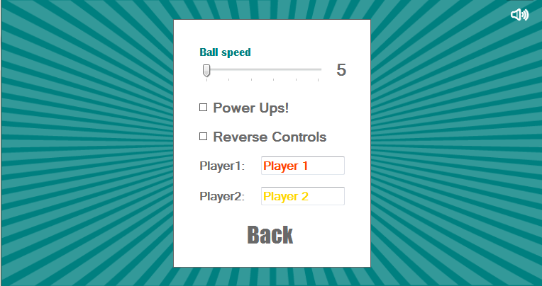
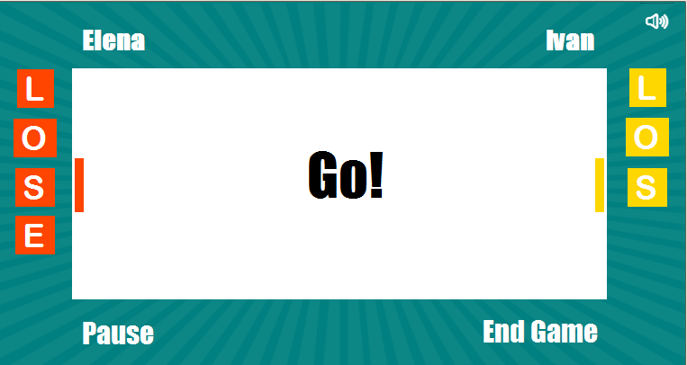

# PongSharp


Понг е една од првите аркадни видео игри која достигнала инстантна комерцијална популарност. Проектот произлегол како задача зададена од страна на Нолан Бушел (ко-основач на Атари) кон Алан Алкорн во 1972 год. Замислата на играта била таа да претставува симулација на 2D тенис, каде играчите со помош на лопатките го одбиваат топчето со цел да му дадат гол на противникот.

Линк од игра од тој тип: www.ponggame.org/battle-pong.php

###За играта

Нашата замисла беше да ја направиме играта Pong# која ќе биде во multiplayer mode, а целта на играта е иста како и во своите предци игри. При прво пуштање на играта се прикажува следниот изглед:



Во Controls можете да видите со кои контроли треба да играат играчите. 



Во Options има некои дополнителни опции. Може да се подеси брзината на топчето од 5-10, да се додадат PowerUps (намалување/зголемување на лопатката, менување на насоката на топчето и одземање на една буква од резултатот за оној што го фатил PowerUp - от) и да се одбере Reverse Controls со што лопатките би се движеле во обратна насока. Исто така овде се внесуваат имињата кои по Default се Player 1 и Player 2.




Првиот Power Up  ја зголемува лопатката, вториот минусира буква од резултатот, третиот ја намалува лопатката и четвртиот ја менува насоката на топчето. Power Ups  се појавуваат рандом на 2 - 5 удари и топчето треба да помине низ нив за да се фати истиот. Power Up – от го добива оној што последен го удрил топчето. Секој PowerUp трае се додека еден од играчите не поентира.
Екранот во кој ќе гледате додека играте е следниов:



На секое поентирање има одбројување 4 секунди одбројување со цел играчите да се припремат за игра. Исто така наместо класично прикажување на резултатот при секое промашување на топчето се испишува по една буква. Губи тој на кој прв ќе му се испиша зборчето LOSER.
Со копчето Pause се паузира играта, а со копчето End Game се враќате на менито.

### Решение на проблемот

За погледите како и за лопатките со кои се удира топчето се употребени панели. За движење  на панелите се користи низа од 4 bool вредности (за придвижување со W, S, up, down). Брзината на топчето се одредува со int вредности како и со BarScroll во Options менито (подесување од страна на корисникот). Топчето е направено со помош на формата OvalShape и неговото движење се формира на тој начин што се иницијализира нова на одреден временски период. Позадината и дизајнот на PowerUps  е направена со помош на Illustrator.
За PowerUps имаме една bool низа од 4 елементи, PictureBox и бројач. Бројачот се зголемува со секој удар на лопатките ако нема активен PowerUp во играта. Се проверува дали бројачот е еднаков на рандом број од 2 до 5. Ако го исполнува овој услов, на рандом место во низата се поставува вредност True и според тоа која позиција во низата е пополнета со True се менува сликата PictureBox  и се поставува на рандом место во рамки на теренот за играње. На секој тајмер тик се проверува дали локацијата на топката се пресекува со локацијата на PictureBox – от. Ако се пресекува, тогаш се извршува функцијата на поставениот PowerUp.  Притоа се проверува од која страна доаѓа топката со помош на променливата BallVel за да се знае кој играч го фатил PowerUp – от. Откако ќе се изврши PowerUp – от  вредноста на тоа поле од низата се поставува на False и PictureBox – от се поставува да биде невидлив. 

### Опис на функции

```
        private void Start_MouseHover(object sender, EventArgs e)
        {
            if (sender.Equals(Start))
                Start.ForeColor = Color.Gold;
            else if (sender.Equals(Mode))
                Mode.ForeColor = Color.Crimson;
            else if (sender.Equals(Options))
                Options.ForeColor = Color.OrangeRed;
            else if (sender.Equals(Exit))
                Exit.ForeColor = Color.Green;
            else if (sender.Equals(OptionsBack))
                OptionsBack.ForeColor = Color.OrangeRed;
            else if (sender.Equals(ControlsBack))
                ControlsBack.ForeColor = Color.Crimson;
        }

```
Функцијата Start_MouseHover (object sender, EventArgs e) служи да се смени бојата на текстот од менито кога ќе се позиционираме над некој збор.
Во функцијата Form1_KeyDown(object sender, KeyEventArgs e) доколку играта е почната и селектирано е RadioButton-от CheckReverse на секоја контрола и се препишува обратна функција од тоа што го правела до тогаш односно ако копчињата w и up ни служеле да ја придвижиме лопатката нагоре, сега им се задава задача да ја придвижуваат лопатката надоле, а копчињата down и s сега имаат задача да ја придвижуваат лопатката нагоре.

```
private void Form1_KeyDown(object sender, KeyEventArgs e)
        {
            Keys key = e.KeyCode;
    
                if (CheckReverse.Checked)
                {
                    if (key == Keys.W)
                    {
                        movement[0] = false;
                        movement[1] = true;
                    }
                    else if (key == Keys.S)
                    {
                        movement[1] = false;
                        movement[0] = true;
                    }
                    if (key == Keys.Up)
                    {
                        movement[2] = false;
                        movement[3] = true;
                    }
                    else if (key == Keys.Down)
                    {
                        movement[3] = false;
                        movement[2] = true;
                    }
                }
                else
                {
                    if (key == Keys.W)
                    {
                        movement[0] = true;
                        movement[1] = false;
                    }
                    else if (key == Keys.S)
                    {
                        movement[1] = true;
                        movement[0] = false;
                    }
                    if (key == Keys.Up)
                    {
                        movement[2] = true;
                        movement[3] = false;
                    }
                    else if (key == Keys.Down)
                    {
                        movement[3] = true;
                        movement[2] = false;
                    }
                }
        }

```
### Изработиле:

* Елена Стојанова 123009
* Иван Трајков 123046	
* Лилјана Димовска 123022
